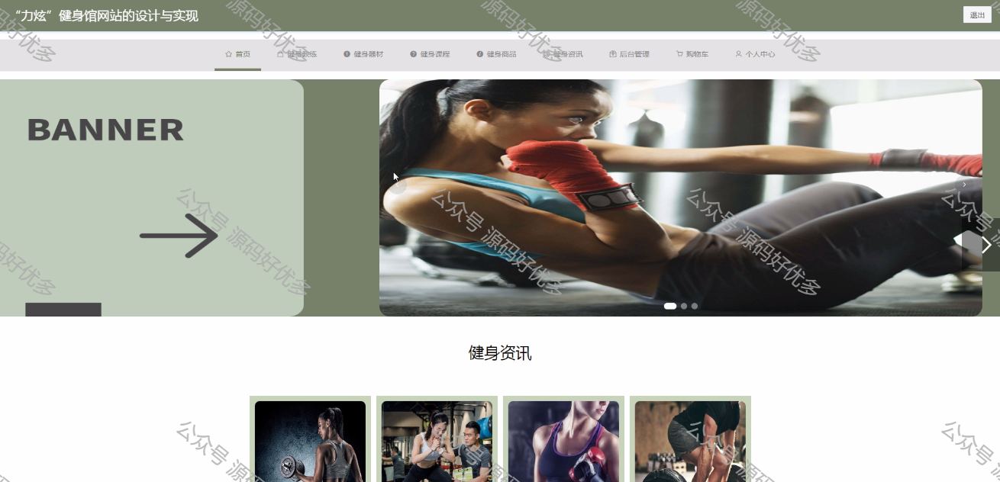

 
## 查看主页获取源码

> **作者介绍**： **✌**全网粉丝10W+本平台特邀作者、博客专家、CSDN新星计划导师、java领域优质创作者,博客之星、掘金/华为云/阿里云/InfoQ等平台优质作者、专注于毕业项目实战 **✌**

  

### 一、作品包含

源码+数据库+设计文档万字LW+PPT+全套环境和工具资源+部署教程

### 二、项目技术

前端技术：Html、Css、Js、Vue、Element-ui

数据库：MySQL

后端技术：Java、Spring Boot、MyBatis

  

### 三、运行环境

开发工具：IDEA/eclipse

数据库：MySQL5.7

数据库管理工具：Navicat10以上版本

环境配置软件： JDK1.8+Maven3.6.3

前端Nodejs：14

  

### 四、项目介绍
项目编号：springbootA063

随着网络科技的不断发展以及人们经济水平的逐步提高，网络技术如今已成为人们生活中不可缺少的一部分，而信息管理系统是通过计算机技术，针对用户需求开发与设计，该技术尤其在各行业领域发挥了巨大的作用，有效地促进了“力炫”健身馆的发展。然而，由于用户量和需求量的增加，信息过载等问题暴露出来，为改善传统线下管理中的不足，本文将提出一“力炫”健身馆网站，计算机技术作为近十年来新发展起来的科技，可运用于众多领域中，尤其在“力炫”健身馆中，可有效地提升其效率。提高现下“力炫”健身馆网站的准确度，同时降低经济波动带来的不良影响，希望本文能对广大学者的研究提供参考。

### 五、运行截图

  
